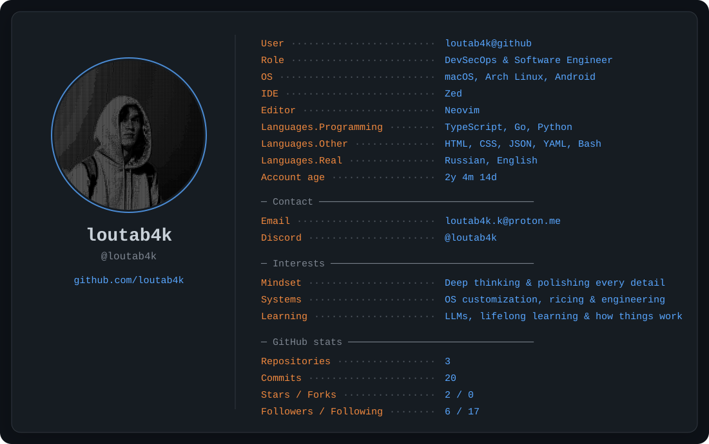

<a href="https://github.com/loutab4k">
  <picture>
    <source media="(prefers-color-scheme: dark)" srcset="./profile-dark.svg">
    <source media="(prefers-color-scheme: light)" srcset="./profile-light.svg">
    
  </picture>
</a>

<!-- Generated by scripts/generate_profile.py. Edit profile.json, not the SVG files. -->
